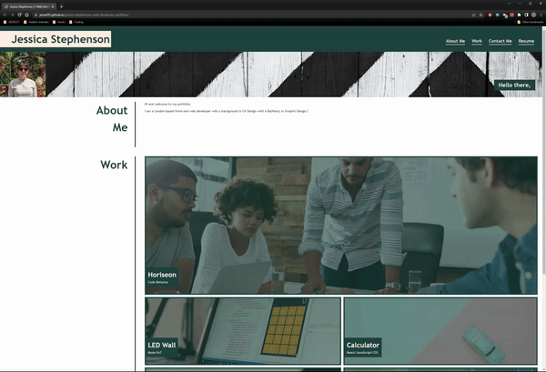
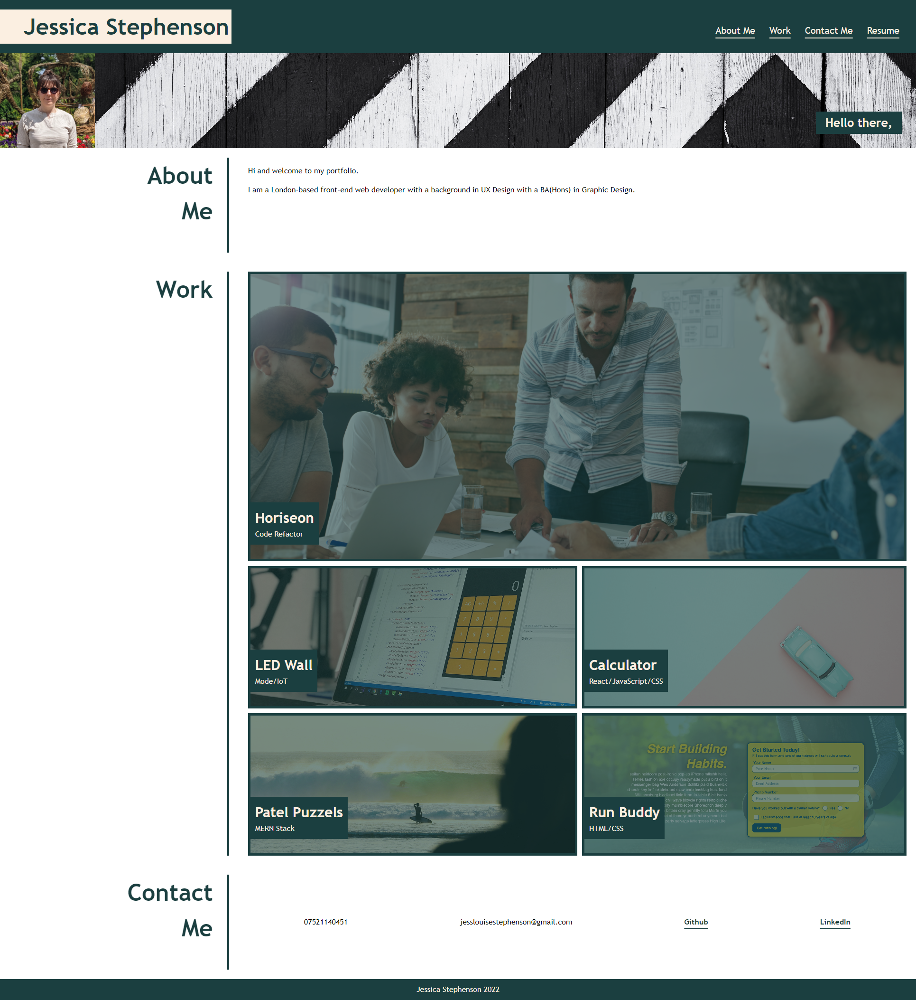
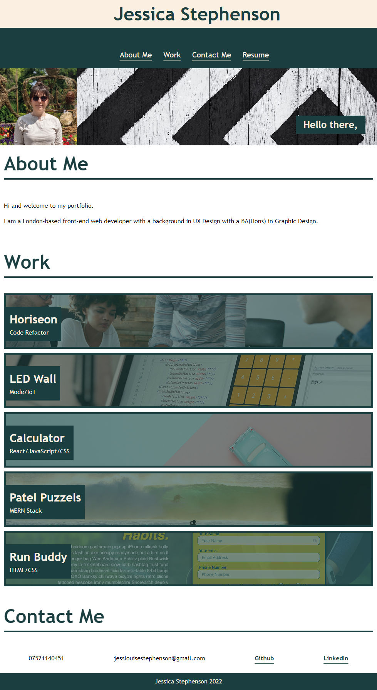
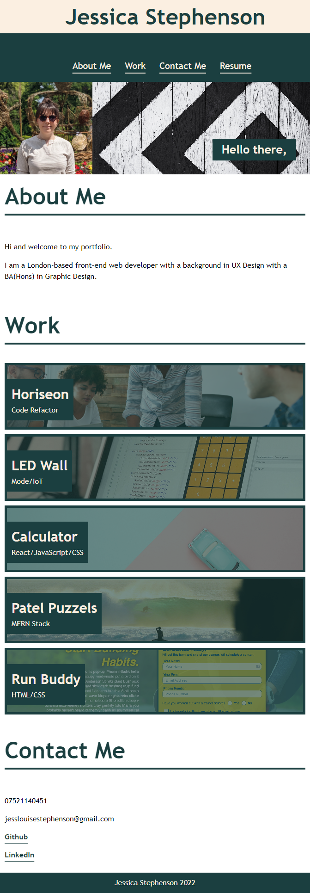

## Portfolio for Jessica Stephenson // Web Developer

# Description
Portfolio for Jessica Stephenson - Junior Front-End Web Developer.
Creation of personal portfolio using HTML and CSS to showcase my up and coming projects. 

> **Note**: All projects within this portfolio are placeholders except the Horiseon code refactor project. All placeholder projects will link to the Horiseon code refactor project page.

# Criteria

* When the page is loaded the page presents your name, a recent photo or avatar, and links to sections about you, your work, and how to contact you
* When one of the links in the navigation is clicked then the UI scrolls to the corresponding section
* When viewing the section about your work then the section contains titled images of your applications
* When presented with the your first application then that application's image should be larger in size than the others
* When images of the applications are clicked then the user is taken to that deployed application
* When the page is resized or viewed on various screens and devices then the layout is responsive and adapts to my viewport
    * Smallest Screen size: 0-769px
    * Next Screen Size: 770px-979px
    * Largest Screen Size: 980px - ~

# Technologies Used
This portfolio was created using
* HTML
* CSS

# Screenshot

Once deployed the website can be viewed in a traditional desktop browser.

The following images show the web application's appearance and functionality at different screen sizes:
* Smallest Screen size: 0-769px
* Next Screen Size: 770px-979px
* Largest Screen Size: 980px - ~

## The screenshot below has a width of 980px - ~

> **Note**: This layout has been designed for viewing on a desktop. 

## The screenshot below has a width of 770px - 979px.

> **Note**: This layout has been designed for viewing on a slightly smaller screen that the screenshot above, so you may notice that some of the elements have been changed to fit a resolution. These include but not limited to the navigation bar and the way the projects are now displayed.

## The screenshot below has a max width of 769px.

> **Note**: This layout has been designed for viewing on a smaller screen size, so you may notice that some of the elements have been changed to fit an even smaller resolution. These include but not limited to the navigation bar, the way the projects and Contacts are now displayed.

# Deployed Page
Link to deployed site 
https://jessie93.github.io/jessica-stephenson-web-developer-portfolio/

# License 
MIT License

Copyright (c) [2022] [Jessica Stephenson]

Permission is hereby granted, free of charge, to any person obtaining a copy
of this software and associated documentation files (the "Software"), to deal
in the Software without restriction, including without limitation the rights
to use, copy, modify, merge, publish, distribute, sublicense, and/or sell
copies of the Software, and to permit persons to whom the Software is
furnished to do so, subject to the following conditions:

The above copyright notice and this permission notice shall be included in all
copies or substantial portions of the Software.

THE SOFTWARE IS PROVIDED "AS IS", WITHOUT WARRANTY OF ANY KIND, EXPRESS OR
IMPLIED, INCLUDING BUT NOT LIMITED TO THE WARRANTIES OF MERCHANTABILITY,
FITNESS FOR A PARTICULAR PURPOSE AND NONINFRINGEMENT. IN NO EVENT SHALL 
